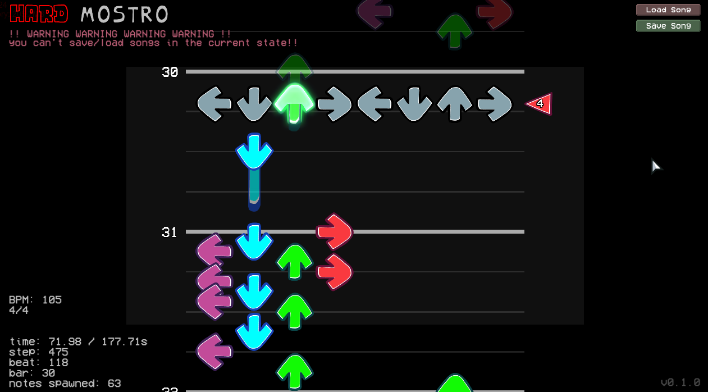

## work in progress
its really weird and you cant save or load right now!!
waveform implementation based on [this script](https://canary.discord.com/channels/922849922175340586/1034490618921107467) (discord forum link)

  

    
  

(all things subject to change)
