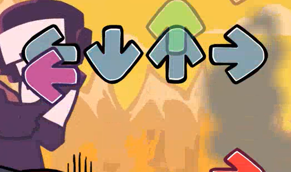
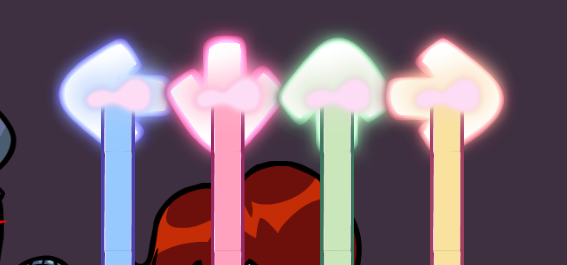
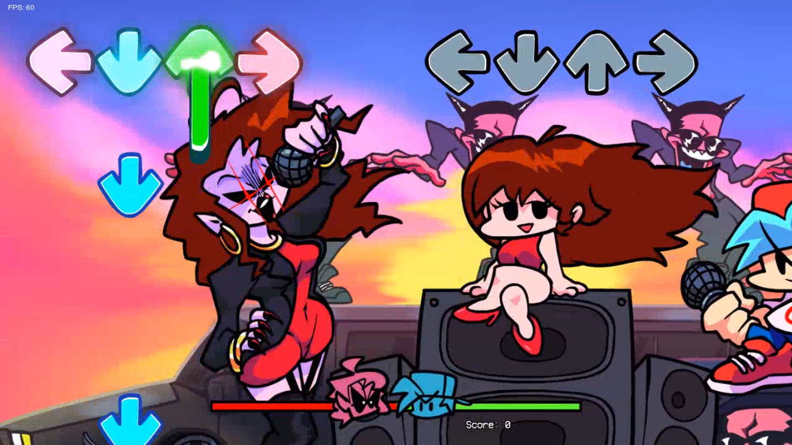
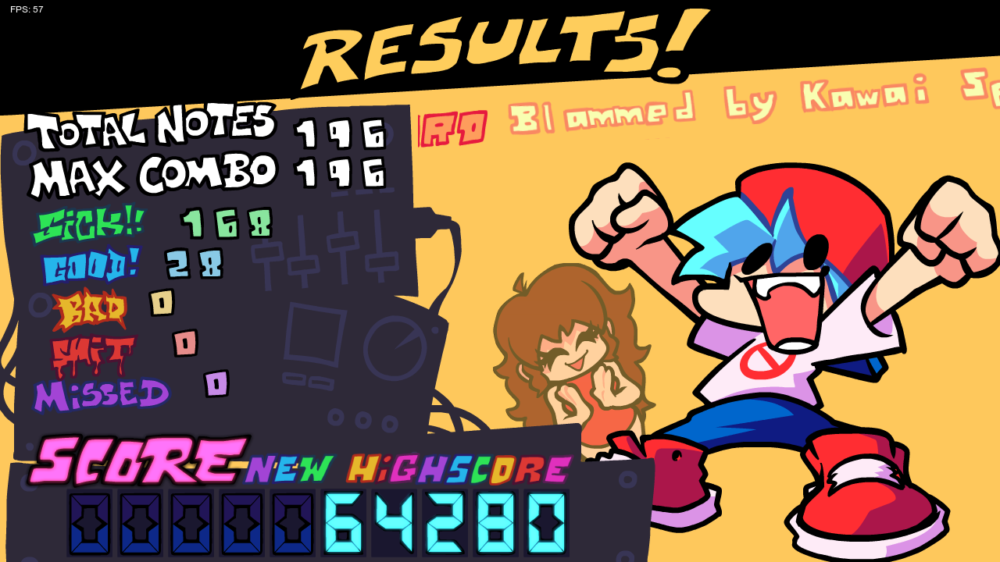

## FNF 0.3.0 UI
**TARGET VERSION:** 0.7.3 
replicates the base fnf 0.3.0 interface in psych engine 
see all todos inside the scripts 
"sustains as one note" recommended 
screenshots later!

### features
- results screen
- hold cover effects (rgb note shader supported)
- note shadows on bad/miss (and combo break)
- a shoddy chart/event converter,
and more

### screenshots

### todo
- ratings
- code cleanup : )
- new score system
- new pause menu?

### credits
unknown difficulty (results screen) - emily(me) 
assets property of funkin crew