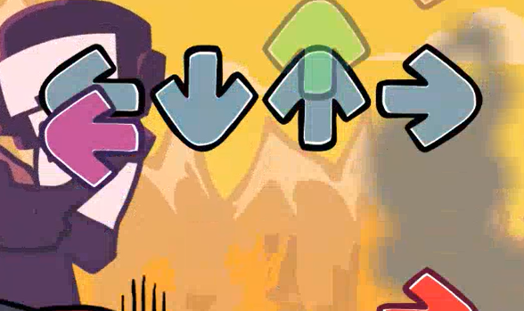
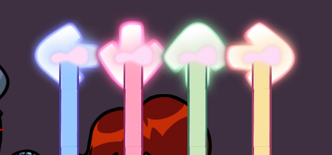
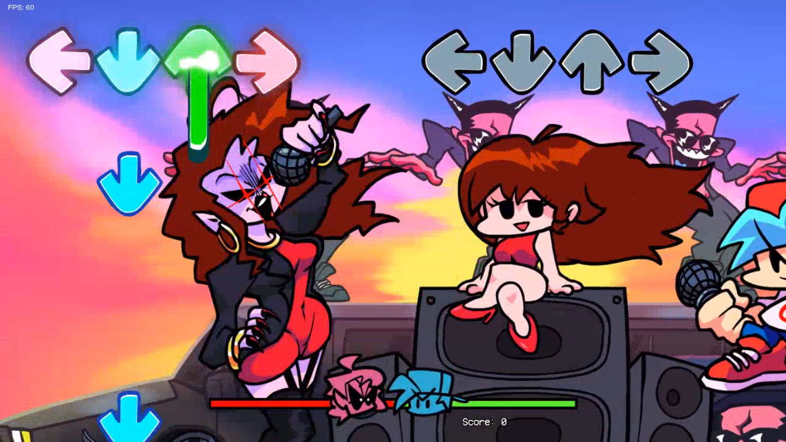
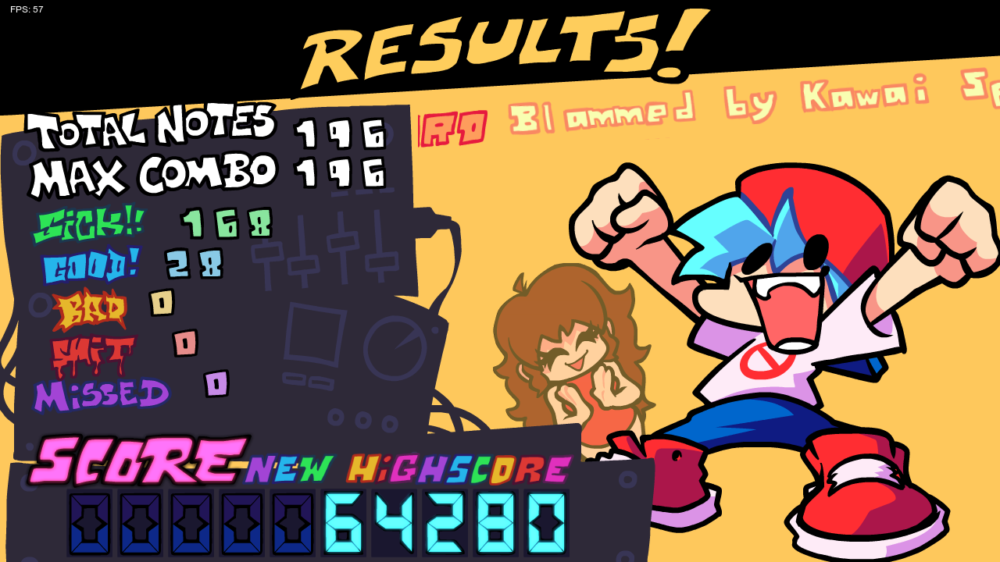
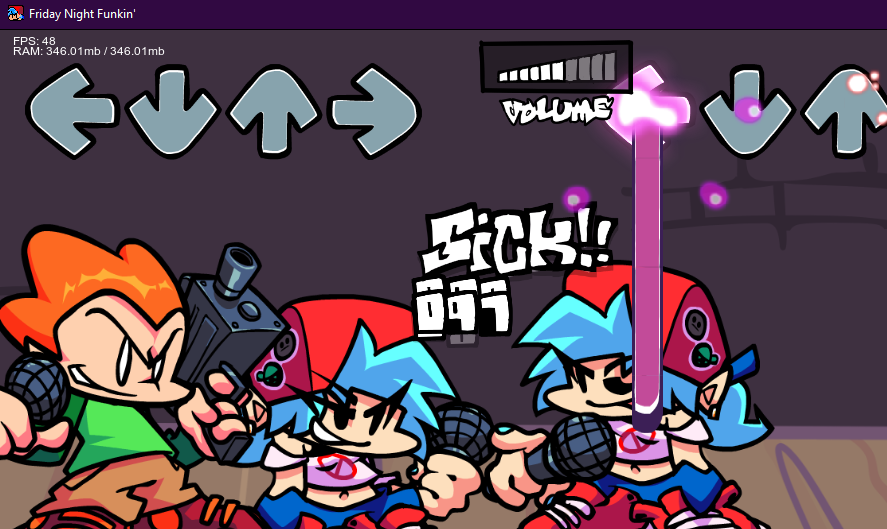

## WEEKEND INTERFACE
**TARGET VERSION:** 1.0.3 
replicates the interface of the base game's weekend update in psych engine 
see all todos inside the scripts 

gamebanana upload [here](https://gamebanana.com/mods/580468)

### features
- combo milestones
- scoring system (PBOT1)
- results screen
  - [NEW] supports CUSTOM PLAYER JSONS (bf and pico by default)
- hold cover effects (rgb notes supported)
- note shadows on bad note hits & combo breaks
- modified fps and soundtray displays
- a shoddy chart/event converter, 
and more

### screenshots

  

    
    
  

  

    
    
  

  

    
  

### todo
- [x] ratings
- [x] new score system (only PBOT1 currently)
- [ ] code cleanup :) **(IN PROGRESS)**
- [ ] readd song header clipping in results screen
- [ ] new pause menu?

### credits
assets property of funkin crew 
code and additional assets/art by emily/superinky(me)
